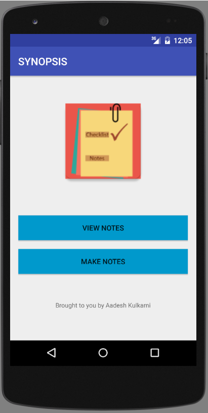
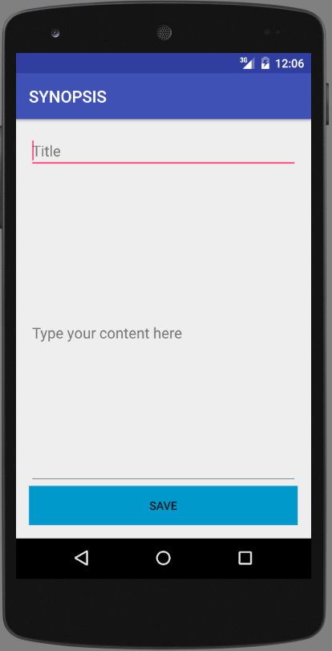
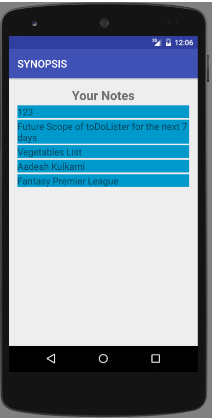
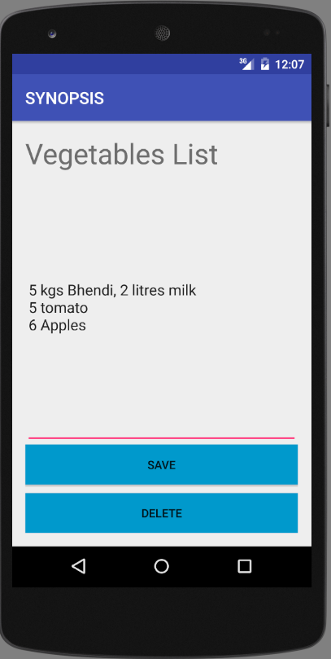

# Synopsis
<h3> Description: </h3>
Synopsis: A brief summary or general survey of something..

An Android App that saves brief information like Schedule, To Do List, Grocery list or anything you want.
Its simple, easy to use and fast. You can make Notes, Edit them later, Delete them and Save them for future use. 

<h3>Screenshots</h3>

<h3> Future Scope </h3>

1. Adding color to notes to give importance(for instance, RED = Urgent, Blue=Average importance)
2. Share option (to share notes on Whatsapp and other social media apps)
3. Setting maximum size for Title, description (and Validation features too)
4. integrating Notes with an Account (like Gmail ) 
